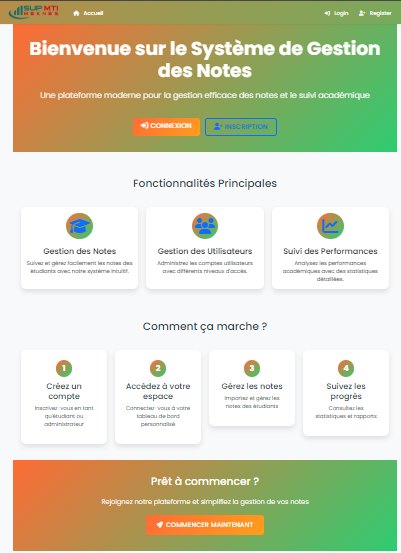

# Grade Management System

A modern grade management system for educational institutions, developed with Laravel.

## Prerequisites

- PHP >= 8.1  
- Composer  
- SQLite *(or another supported DBMS)*  
- Node.js & NPM (for assets)

## Installation

1. **Clone the repository**
   ```bash
   git clone [REPO_URL]
   cd system-management
   ```

2. **Install PHP dependencies**
   ```bash
   composer install
   ```

3. **Configure the environment**
   ```bash
   cp .env.example .env
   php artisan key:generate
   ```

4. **Set up the database**
   - Open the `.env` file
   - Modify the database configuration:
     ```
     DB_CONNECTION=sqlite
     DB_DATABASE=/absolute/path/to/database.sqlite
     ```

5. **Run migrations**
   ```bash
   php artisan migrate
   ```

6. **Seed the database with test data**
   ```bash
   php artisan db:seed
   ```

7. **Install NPM dependencies and compile assets**
   ```bash
   npm install
   npm run dev
   ```

8. **Start the development server**
   ```bash
   php artisan serve
   ```

## System Access

- URL : http://localhost:8000
- Default Admin Account:
  - Email : admin@example.com
  - Password: 123456789@
- Default Student Account:
  - Email : student@example.com
  - Password: student code
  - 
## Features

- User management (Admin)
- Grade management
- Custom dashboard
- Responsive interface
- Authentication system
- Role management (Admin/Student))

## Project Structure

```
system-management/
├── app/
│   ├── Http/
│   │   ├── Controllers/
│   │   └── Middleware/
│   ├── Models/
│   └── Services/
├── database/
│   ├── migrations/
│   └── seeders/
├── resources/
│   ├── views/
│   └── css/
├── routes/
│   └── web.php
└── tests/
```

## Development
For development:
```bash
npm run dev
```

For production:
```bash
npm run build
```

## Testing

To run the test suite:
```bash
php artisan test
```

## Support

For questions or issues, please open an issue on the repository.

## License

This project is licensed under the MIT License.

## 🎥 Demo Video

[](https://drive.google.com/file/d/1LT98ejjDdQC1FFxX-QKhJlqXCbyiM0NA/view?usp=sharing)

